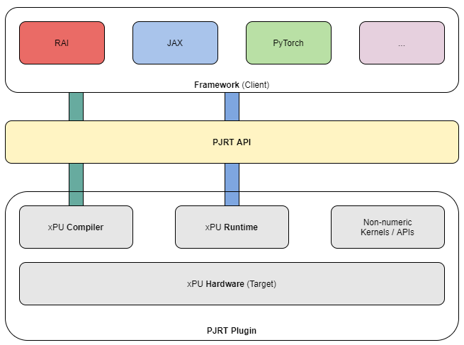

# PJRT-RS


[](https://docs.rs/pjrt)
[](https://crates.io/crates/pjrt)
[](https://discord.gg/J7X8rNZeMC)

**`pjrt`** is a safe [PJRT](https://opensource.googleblog.com/2023/05/pjrt-simplifying-ml-hardware-and-framework-integration.html) C API bindings for Rust.



# Example
```rust
use pjrt::ProgramFormat::MLIR;
use pjrt::{self, Client, HostBuffer, LoadedExecutable, Result};

const CODE: &'static [u8] = include_bytes!("program.mlir");

fn main() -> Result<()> {
    let api = pjrt::load_plugin("pjrt_c_api_cpu_plugin.so")?;
    println!("api_version = {:?}", api.version());

    let client = Client::builder(&api).build()?;
    println!("platform_name = {}", client.platform_name());

    let program = pjrt::Program::new(MLIR, CODE);

    let loaded_executable = LoadedExecutable::builder(&client, &program).build()?;

    let a = HostBuffer::scalar(1.0f32);
    println!("input = {:?}", a);

    let inputs = a.copy_to_sync(&client)?;

    let result = loaded_executable.execution(inputs).run_sync()?;

    let ouput = &result[0][0];
    let output = ouput.copy_to_host_sync()?;
    println!("output= {:?}", output);

    Ok(())
}
```

## LICENSE
This project is licensed under either of

- Apache License, Version 2.0, ([LICENSE-APACHE](LICENSE-APACHE) or
  http://www.apache.org/licenses/LICENSE-2.0)
- MIT license ([LICENSE-MIT](LICENSE-MIT) or
  http://opensource.org/licenses/MIT)

at your option.
